# Cloudflare Notes

一个可以直接部署到 Cloudflare Workers 的单文件云端笔记应用。项目使用 Cloudflare R2 保存数据，不依赖传统数据库；笔记内容在浏览器端使用用户输入的加密 Key 加密后再上传，服务端只保存密文。

适合个人保存一些需要加密记录的文本内容，也适合作为 Cloudflare Worker + R2 + 前端加密的小型开源项目进行二次开发。🚀

## 一些页面截图

> 🚀同时支持电脑和手机端访问

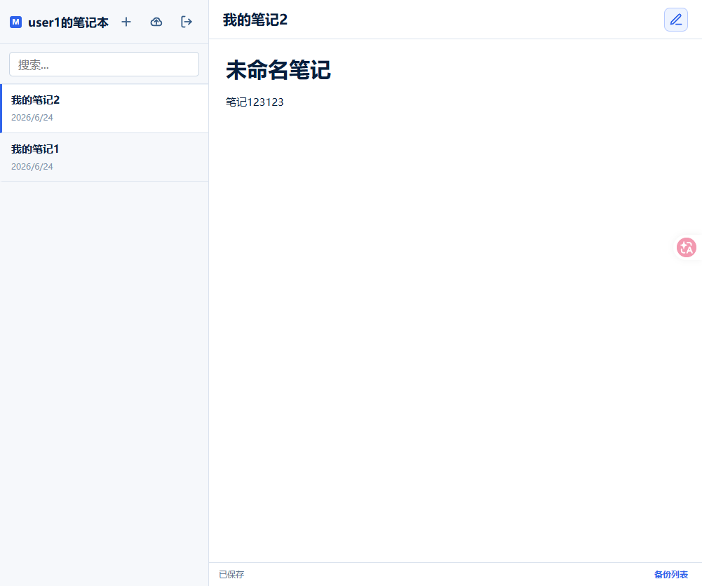

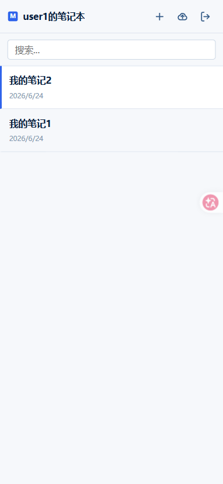

## 为什么开发这个项目

很多人都有一堆账号和密码：服务器、后台系统、数据库、API Token、临时口令、内网地址、各种备注。直接靠脑子记不现实，写在普通网盘、在线文档、网络笔记里又总觉得不踏实。🔐

这个项目的想法很简单：把笔记系统部署在自己的 Cloudflare Worker 上，数据放在自己的 R2 里，笔记正文在浏览器端先用自己的加密 Key 加密，再保存到云端。只要你的加密 Key 设置得足够复杂，即使 R2 中的笔记文件被下载，泄露风险也会更小。🛡️

项目现在已经支持企业微信机器人报警：登录账号或密码错误、加密 Key 输入错误、手动备份成功，都可以推送到企业微信群里。📢

## 功能特点

- 🚀 单个 `app.js` 即可部署到 Cloudflare Worker。
- 🪣 使用 Cloudflare R2 保存用户信息、加密笔记和手动备份。
- 📝 支持登录、笔记新增、编辑、删除、搜索和 Markdown 预览。
- 🖱️ 支持左侧笔记列表拖拽排序，排序结果会保存到 R2。
- ⌨️ 支持 `Ctrl + S` / `Cmd + S` 快捷键保存。
- 🧩 Markdown 预览支持标题、引用块、表格、代码块、列表、任务列表、链接、图片、删除线、有限安全 HTML 等语法。
- 💾 支持手动备份 R2 中的用户和笔记数据。
- 📢 支持企业微信机器人报警，可选配置，不配置也能正常使用。
- 🔓 提供 `decrypt_notes.py`，可将从 R2 下载的加密 JSON 在本地解密导出为 Markdown 或 JSON。
- 🙈 前端加密 Key 不写入 R2，也不写入浏览器 `localStorage` / `sessionStorage`。

## 项目结构

```text
.
├── app.js              # Cloudflare Worker 单文件入口，包含前端页面、样式、API 和加密库
├── decrypt_notes.py    # 本地解密 R2 笔记 JSON 的工具
├── requirements.txt    # Python 解密工具依赖
├── README.md           # 项目说明和部署文档
└── images/             # README 截图资源
```

## 数据存储

部署后，项目会在绑定的 R2 Bucket 中使用以下路径：

```text
user_info/users.json       # 用户名和登录密码
user_data/{username}.json  # 指定用户的加密笔记数据
note_order/{username}.json # 指定用户的左侧列表排序
backup_folder/{time}/      # 手动备份生成的数据快照
```

首次访问登录接口时，如果 R2 中没有 `user_info/users.json`，Worker 会自动创建默认用户：

```json
{
  "user1": "pwd1"
}
```

部署后请尽快修改这个默认用户和密码。当前项目为了保持简单，`user_info/users.json` 中的登录密码是明文保存；笔记正文是加密保存。

R2 中的数据结构大概如下：👇

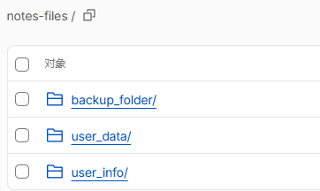

## 部署步骤

### 1. 创建 R2 Bucket 🪣

在 Cloudflare 控制台创建一个 R2 Bucket，名称可以自定义，例如：

```text
notes-files
```

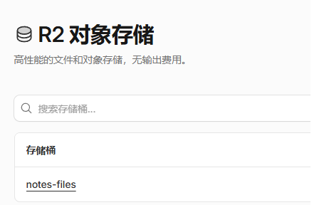

### 2. 创建 Worker ⚙️

在 Cloudflare Workers 中创建一个 Worker，然后把本项目的 `app.js` 内容复制到 Worker 编辑器中。

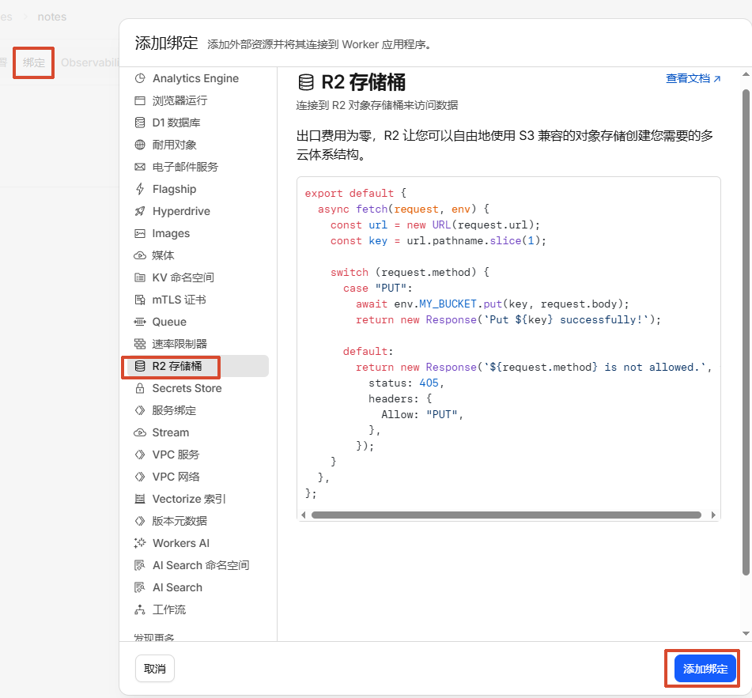

### 3. 绑定 R2 Bucket 🔗

在 Worker 的设置中添加 R2 Bucket 绑定：

```text
变量名称: R2_BUCKET
R2 Bucket: 选择你创建的 bucket
```

变量名称必须是 `R2_BUCKET`，因为代码中固定使用 `env.R2_BUCKET` 访问存储。

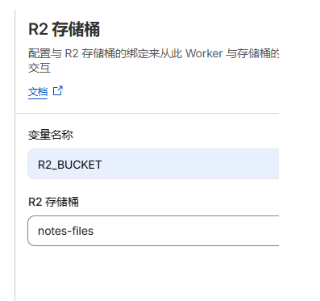

绑定成功后会看到类似下面的状态：

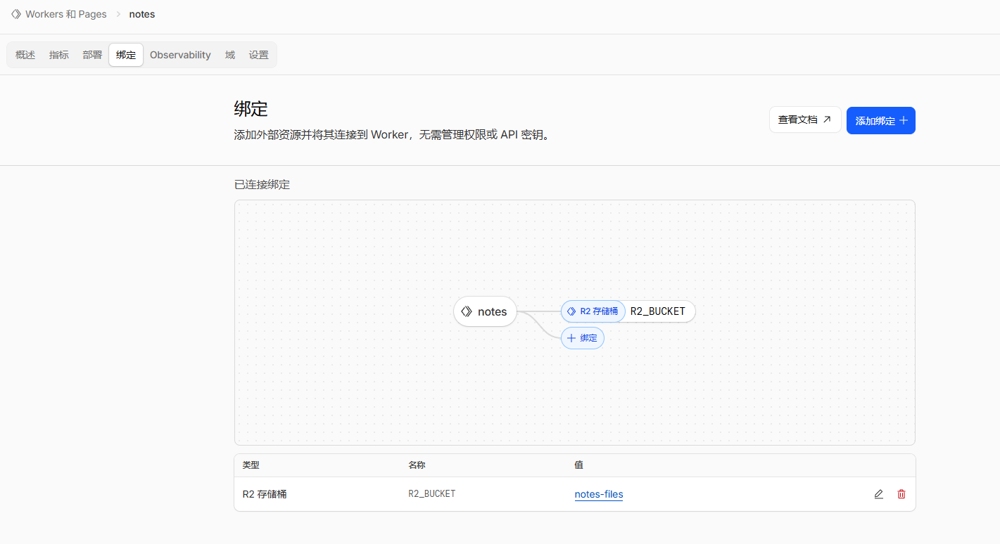

### 4. 配置 Session Secret 🔑

在 Worker 的“变量和密钥”中添加环境变量：

```text
变量名称: SESSION_SECRET
值: 一段足够长的随机字符串
```

`SESSION_SECRET` 用于签名登录会话 Cookie。不要使用示例值，也不要把真实值提交到 GitHub。

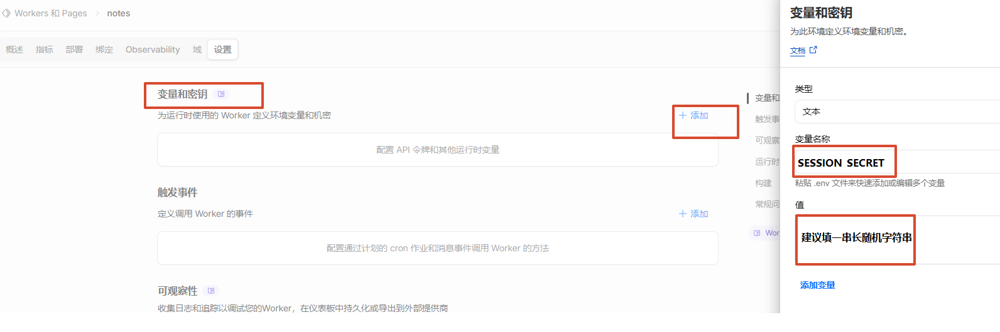

### 5. 可选：配置企业微信报警 📢

如果你希望登录失败、加密 Key 错误、手动备份成功时收到企业微信提醒，可以在 Worker 的“变量和密钥”中继续添加：

```text
变量名称: QYWX_WEBHOOK_URL
值: https://qyapi.weixin.qq.com/cgi-bin/webhook/send?key=你的企业微信机器人key
```

这个变量是可选的：

- 配置了 `QYWX_WEBHOOK_URL`：会发送企业微信 markdown 报警。
- 不配置 `QYWX_WEBHOOK_URL`：不会报警，其他功能照常使用。
- 配置错了 URL：只会在 Worker 日志中记录发送失败，不会中断登录、解密或备份流程。

### 6. 上传代码 📤

把 `app.js` 中的代码复制到 Cloudflare Worker 编辑器中，然后保存并部署。

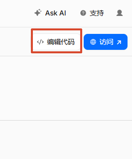

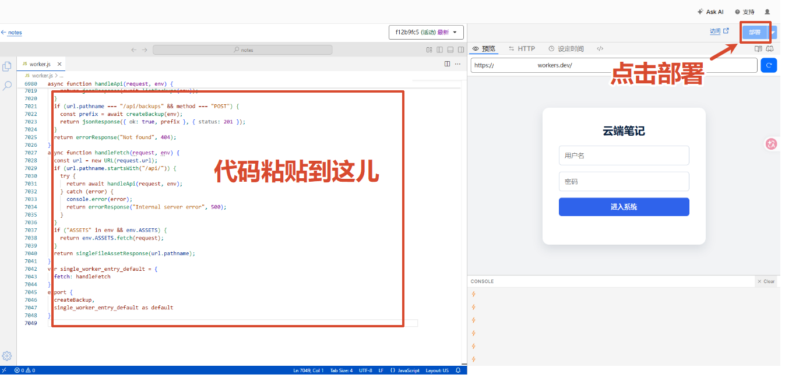

### 7. 访问应用 🎉

保存并部署 Worker 后，打开 Worker 提供的访问地址。

默认登录信息：

```text
用户名: user1
密码: pwd1
```

登录后还需要输入你的笔记加密 Key。这个 Key 用于加密和解密笔记内容，服务端不会保存它。

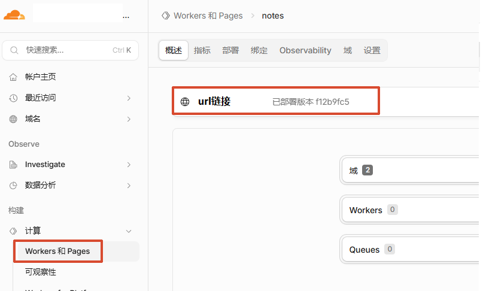

## 使用说明

### 登录密码和加密 Key 的区别 🔐

登录密码用于进入系统，默认保存在 R2 的 `user_info/users.json`。

加密 Key 用于加密和解密笔记正文。即使能登录系统，如果加密 Key 错误，也无法正常读取已有笔记内容。

请妥善保存加密 Key。丢失后，已经加密的笔记无法恢复。

### 笔记列表拖拽排序 🖱️

左侧笔记列表支持鼠标拖拽排序。直接按住某条笔记上下拖动即可调整顺序。

排序结果会写入 R2：

```text
note_order/{username}.json
```

如果当前正在搜索，列表只显示搜索结果，此时不会进行持久化排序。清空搜索后再拖拽即可。

### Markdown 预览 🧩

当前预览支持常用 Markdown 语法：

- `#` 到 `######` 标题
- `>` 引用块
- `-` / `*` 无序列表
- `1.` 有序列表
- `- [ ]` / `- [x]` 任务列表
- 代码块和行内代码
- 表格
- 链接和图片
- 粗体、斜体、删除线
- 分割线
- 有限安全 HTML，例如：

```html
<span style="color: Red;">红色文字</span>
```

为了降低 XSS 风险，HTML 只开放少量安全标签和样式，不会完整支持任意 HTML。

### 快捷键保存 ⌨️

编辑笔记时可以使用：

```text
Ctrl + S
```

macOS 可以使用：

```text
Cmd + S
```

快捷键会保存当前正在编辑的笔记，并阻止浏览器默认的“保存网页”行为。

### 修改用户 👤

你可以直接修改 R2 中的 `user_info/users.json`：

```json
{
  "your_username": "your_password"
}
```

用户名只能包含英文字母、数字、下划线和短横线，长度不超过 64 个字符。

如果 R2 中已经存在 `user_info/users.json`，代码不会再次写入默认用户。删除该文件后再次登录时，才会重新生成默认用户 `user1 / pwd1`。

### 手动备份 💾

登录系统后点击页面中的备份按钮，会把以下内容复制到 `backup_folder/{timestamp}/`：

- `user_info/users.json`
- `user_data/` 下的所有用户笔记文件
- `note_order/` 下的所有排序文件

备份只是复制当前 R2 数据，不会额外解密笔记内容。

如果配置了 `QYWX_WEBHOOK_URL`，手动备份成功后会发送企业微信提醒。

### 企业微信报警 📢

配置 `QYWX_WEBHOOK_URL` 后，以下事件会触发报警：

- 登录时账号或密码错误
- 登录请求格式不正确
- 用户名格式不正确
- 登录成功后输入错误的加密 Key
- 手动备份成功

报警内容会包含事件类型、时间、用户名、访问 IP、User-Agent 等信息。

如果没有配置 `QYWX_WEBHOOK_URL`，这些报警逻辑会自动跳过，不影响项目正常运行。

## 本地解密导出

从 R2 下载用户笔记文件，例如：

```text
user_data/user1.json
```

安装 Python 依赖：

```bash
pip install -r requirements.txt
```

导出为 Markdown：

```bash
python decrypt_notes.py -i user_data_user1.json -k your-encryption-key
```

不传 `-k` 时，脚本会通过交互方式输入加密 Key：

```bash
python decrypt_notes.py -i user_data_user1.json
```

导出结果默认写入：

```text
exported_notes/
```

导出为 JSON：

```bash
python decrypt_notes.py -i user_data_user1.json -k your-encryption-key -f json -o decrypted_notes.json
```

只导出指定笔记：

```bash
python decrypt_notes.py -i user_data_user1.json -k your-encryption-key --note-id NOTE_ID
```

解密导出成功后，会得到 Markdown 或 JSON 文件，方便你离线备份、迁移或审计自己的笔记。📦

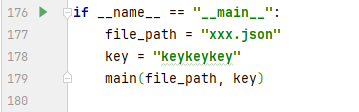

## API 简览

应用前端调用以下 Worker API：

```text
POST   /api/login
POST   /api/logout
GET    /api/me
GET    /api/notes
POST   /api/notes/reorder
POST   /api/note
GET    /api/note/{id}
PUT    /api/note/{id}
DELETE /api/note/{id}
GET    /api/backups
POST   /api/backups
POST   /api/alert/key-error
```

除 `/api/login` 和 `/api/logout` 外，其余接口需要有效登录会话。

## 安全说明

这个项目适合个人学习、轻量自用和二次开发。公开部署或存储敏感内容前，请先理解以下限制：

- ⚠️ 登录用户密码目前明文保存在 R2 的 `user_info/users.json`。
- ⚠️ 默认用户是 `user1 / pwd1`，部署后必须修改。
- 🔑 `SESSION_SECRET` 必须通过 Cloudflare 环境变量配置，不能写入代码。
- 📢 `QYWX_WEBHOOK_URL` 是可选变量；如果配置，请不要把真实 webhook 提交到 GitHub。
- 🔐 笔记内容依赖浏览器端输入的加密 Key，加密 Key 丢失后无法恢复笔记。
- 🧱 当前实现没有注册、密码哈希、登录限流、多因素认证、权限分组等完整账号系统能力。
- 🌐 建议只在 HTTPS 环境下使用。Cloudflare Worker 默认访问地址通常已经支持 HTTPS。

如果你要把它作为正式多人应用继续开发，建议优先改造：

- 🔒 使用密码哈希保存登录密码，例如 PBKDF2、bcrypt、scrypt 或 Argon2。
- 🚨 增加登录失败限流和审计日志。
- 📢 接入企业微信、飞书、Telegram 等通知渠道，在异常行为发生时报警。
- 🧰 为用户管理提供独立的初始化或管理入口。
- 🧩 将前端源码、样式和依赖拆分出来，建立可维护的构建流程。
- ✅ 为 API 和解密工具补充自动化测试。

## 开源发布建议

发布到 GitHub 前，建议确认：

- 不提交 `.venv/`、`.idea/`、`__pycache__/` 等本地开发目录。
- 不提交真实的 R2 数据、备份文件、用户文件或解密后的笔记。
- 不提交真实的 `SESSION_SECRET`、Cloudflare API Token 或其他私密配置。
- 仓库根目录添加合适的 `LICENSE` 文件。如果希望别人自由使用和二次开发，可以考虑 MIT 或 Apache-2.0。
- 在 README 中明确项目定位：个人笔记 Demo / 自用工具 / 二次开发模板，而不是完整生产级账号系统。

## 二次开发

核心逻辑集中在 `app.js`：

- 前端页面、样式和客户端逻辑以字符串形式内置在 Worker 中。
- 服务端 API 位于文件后半部分。
- R2 读写封装在 `readJson`、`writeJson`、`getUserNotes`、`writeUserNotes` 等函数中。
- 会话签名使用 `SESSION_SECRET` 和 HMAC-SHA256。
- 笔记正文加密使用前端 CryptoJS AES passphrase 模式。
- 企业微信报警通过 `QYWX_WEBHOOK_URL` 调用机器人 webhook。
- 左侧拖拽排序通过 `/api/notes/reorder` 保存到 R2。

如果你计划长期维护，建议把 `app.js` 拆分为源码目录，例如：

```text
src/
├── worker.js
├── client/
│   ├── index.html
│   ├── app.js
│   └── styles.css
└── vendor/
```

再使用构建工具生成单文件 Worker，方便 review、测试和协作开发。

## 许可证

请在发布前为仓库添加 `LICENSE` 文件，并在这里写明许可证名称。
